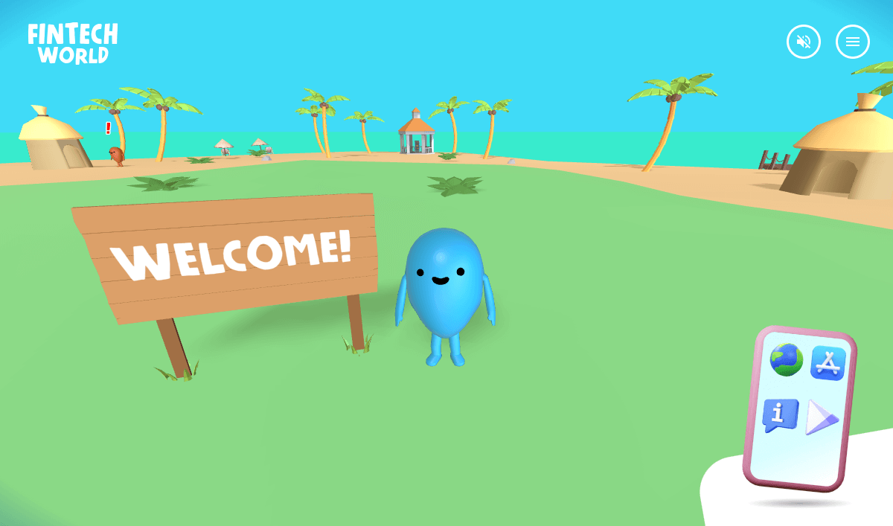

_Fintech World_ is an immersive 3D gamification web platform that promotes, educates, and informs visitors about digital payment solutions offered by fintech companies, through a fun and engaging online experience.

## Information

More details about the project's aim, uses, and features, as well as instructions, screenshots and bibliography can be found in the following document:

[**Fintech World Presentation**](https://docs.google.com/document/d/1ASQHBcZeVYSnMjg3_svXiJQekuDGHybaoA5oLhSk9bU/edit?usp=sharing)

## Technologies

The core technologies of _Fintech World_ are JavaScript, WebGL and WebAssembly (WASM). The following libraries and tools are used:

| Name               | License | Description                                                                   |
| ------------------ | :-----: | ----------------------------------------------------------------------------- |
| React              |   MIT   | Component-based, front-end interface library                                  |
| Three.js           |   MIT   | 3D graphics API for the web, based on WebGL                                   |
| React Three Fiber  |   MIT   | A React renderer for Three.js                                                 |
| Drei               |   MIT   | Useful helpers for React Three Fiber                                          |
| Rapier             | Apache  | Physics library                                                               |
| React Three Rapier |   MIT   | Rapier physics in React                                                       |
| three-stdlib       |   MIT   | Stand-alone library of threejs examples designed to run without transpilation |
| R3F-Perf           |   MIT   | Performance monitoring                                                        |
| Leva               |   MIT   | React-first GUI control panel component                                       |
| Howler.js          |   MIT   | Audio library                                                                 |
| Zustand            |   MIT   | State management                                                              |
| Vite               |   MIT   | Frontend development tooling                                                  |
|                    |         |                                                                               |

## Software Used

A non-exhaustive list of all the software that was used during the development of _Fintech World_.

- Visual Studio Code
- Figma
- Blender
- Adobe Photoshop
- Inkscape
- Google Chrome
- Microsoft Edge
- Mozilla Firefox

## Assets

All the assets used in _Fintech World_ (3D models, textures, images, sound effects, music etc.) are either using Creative Commons / Public Domain or they were created by me and can be freely according to their respective license.

## Acknowledgements

Thanks to [Hugo Wiledal](https://twitter.com/etthugo) for [this](https://codesandbox.io/s/trip-fellas-9d4vm9). Thanks to the amazing team at [Merci-Michel](https://www.merci-michel.com/), their work is outstanding and they have been a constant [source of inspiration](https://coastalworld.com/).

## 💖 Support the Project

Thank you so much for your interest in my project! If you want to go a step further and support my work, buy me a coffee:

## License

Copyright (c) 2023 Michael Kolesidis 
Licensed under the [GNU Affero General Public License v3.0](https://www.gnu.org/licenses/agpl-3.0.html).
